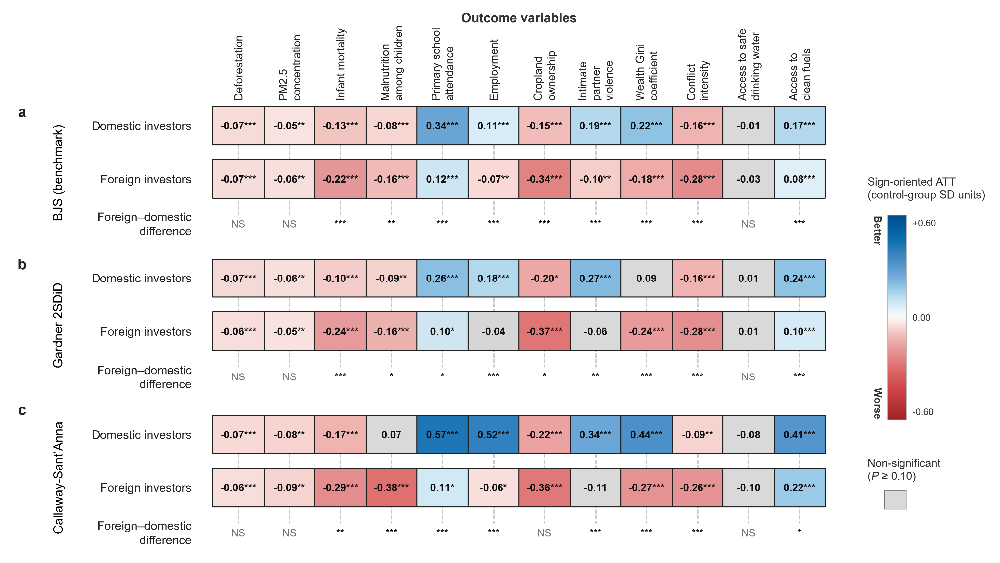

# Alternative staggered DiD estimators

Alternative staggered DiD estimators. a–c, Sign-oriented ATTs from the BJS, Gardner two-stage DiD (2SDiD), and Callaway-Sant’Anna estimators, respectively. Blue and red cells respectively indicate statistically significant beneficial and adverse effects; grey cells indicate non-significant estimates. Difference rows report the significance of contrasts between ownership groups. ***, **, and * denote P < 0.01, P < 0.05, and P < 0.10, respectively; NS denotes P ≥ 0.10. 

[PDF](alternative_estimators.pdf) · [PNG](alternative_estimators.png)

Originally Supplementary Fig. 3.
