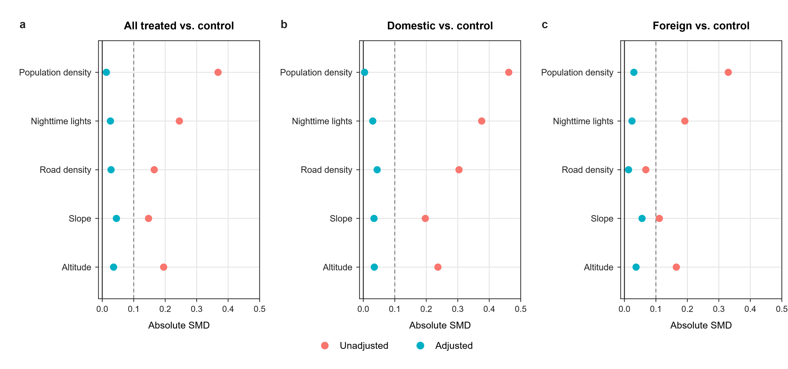

# Covariate balance before and after propensity score matching

Covariate balance before and after propensity score matching. Absolute standardized mean differences (SMDs) for five continuous covariates comparing all treated projects with untreated controls (a), domestic-owned projects with untreated controls (b), and foreign-owned projects with untreated controls (c). Coral and teal points denote unadjusted and PSM-adjusted samples, respectively. Mineral group and host region are exactly matched by construction and are not shown.

[PDF](covariate_balance.pdf) · [PNG](covariate_balance.png)
