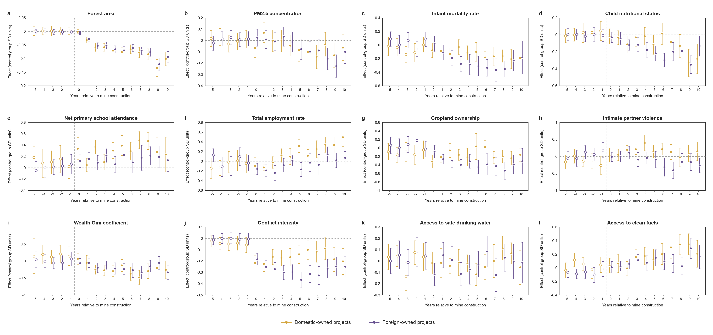

# Dynamic mining effects and ownership heterogeneity

Dynamic mining effects and ownership heterogeneity. a–l, Event-study ATTs in control-group S.D. units for domestic-owned (orange) and foreign-owned (purple) projects. Vertical bars show the 95% confidence intervals. Open and filled markers denote pre-treatment leads and post-treatment estimates, respectively.

[PDF](event_studies.pdf) · [PNG](event_studies.png)

Originally Supplementary Fig. 1.
